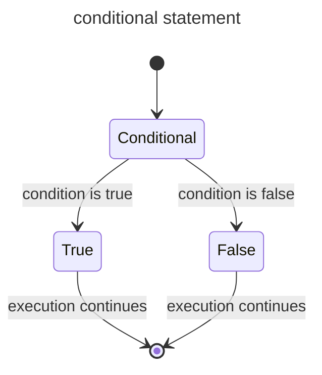
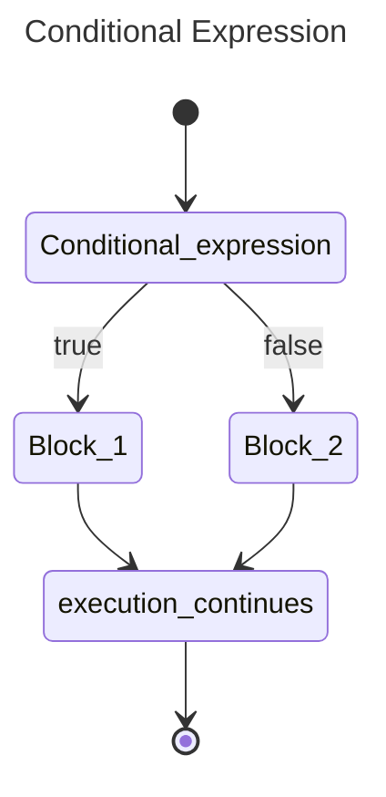
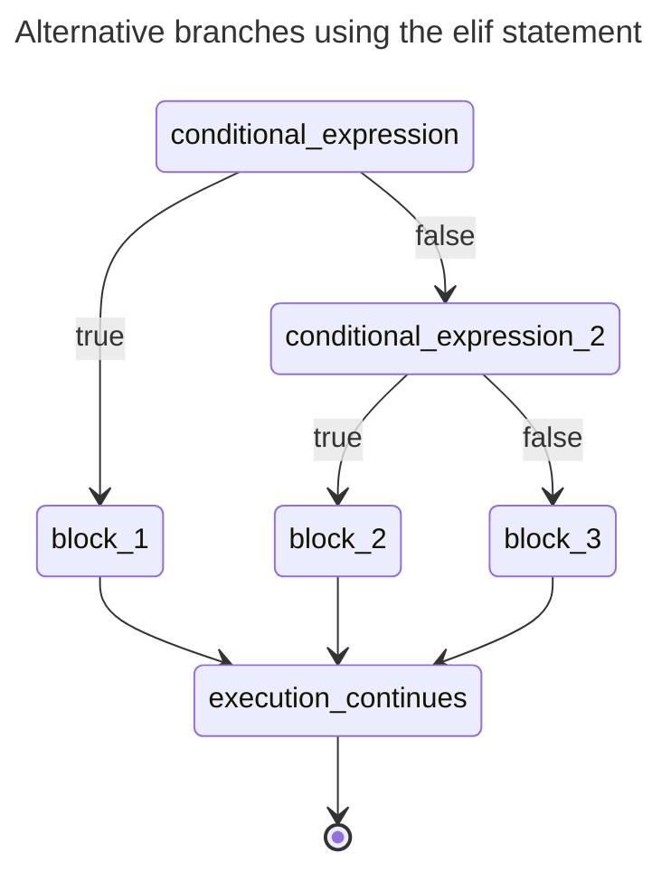
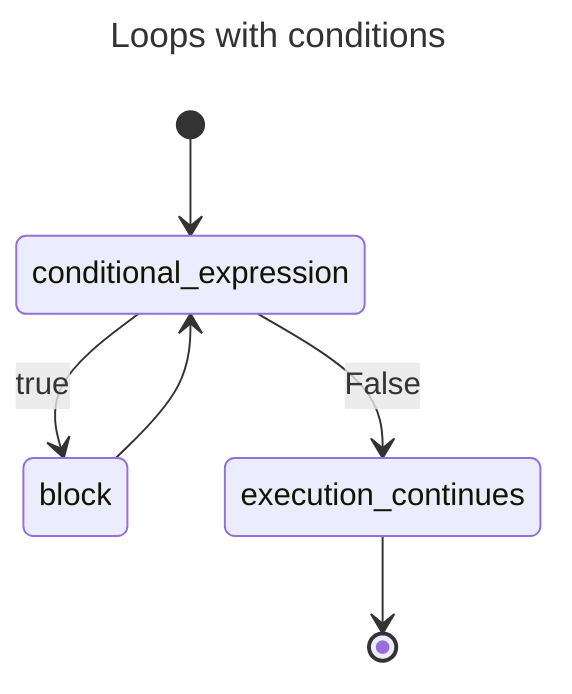
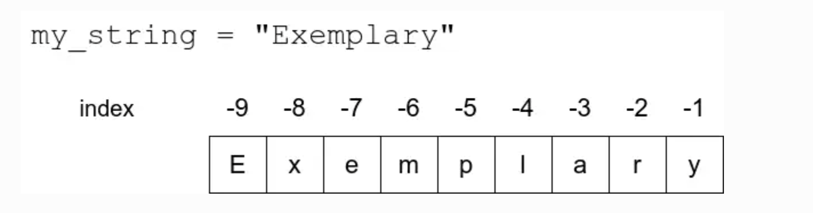
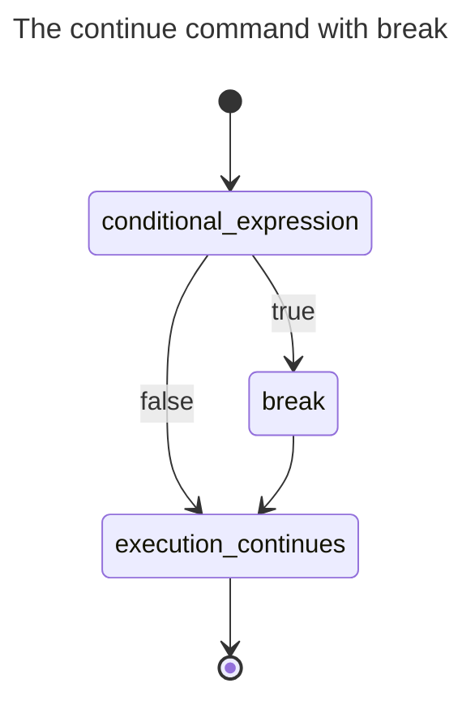
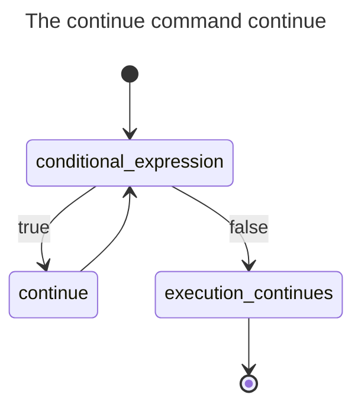
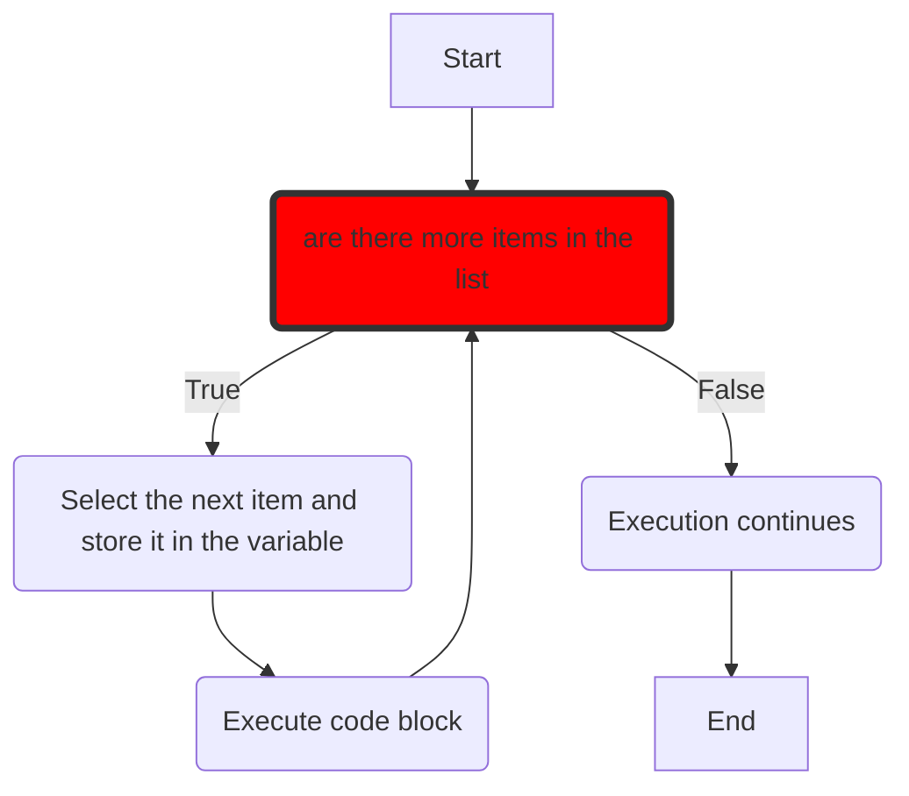

# Python Programming MOOC 2023

https://programming-23.mooc.fi/

## 1. About this course:

The course start on January 16th 2023. This is the course material page for the Introduction to Programming course (BSCS1001, 5 cr) and the Advanced Course in Programming (BSCS1002, 5 cr) from the Department of Computer Science at the University of Helsinki.

## 2. content vs learing objects:

<h1> Part 1:</h1>
<h2>1.1.Getting started</h2>

You will have written and executed your first Python program

You will know how to use the print command

You will be able to use programming for arithmetic operations

<h2>1.2.Information from the user</h2>

You will know how to write a program which uses input from the user

You will know how to use variables to store input and print it out

You will be able to combine strings

<h2>1.3.More about variables:</h2>

You will be able to use variables in different contexts

You will know what kind of data can be stored in variables

You will understand the difference between strings, integers and floating point numbers

<h2>1.4.Arithmetic operations</h2>

You will be able to use variables in various arithmetic operations

You will know how to deal with numbers in user input

You will know how to cast values into other fundamental data types

|          | arithmetics                      |           |        |
| -------- | -------------------------------- | --------- | ------ |
| Operator | Purpose                          | Example   | Result |
| +        | Addition                         | 2 + 4     | 6      |
| -        | Subtraction                      | 10 - 2.5  | 7.5    |
| \*       | Multiplication                   | -2 \* 123 | -246   |
| /        | Division (floating point result) | 9 / 2     | 4.5    |
| //       | Division (integer result)        | 9 // 2    | 4      |
| %        | Modulo                           | 9 %2      | 1      |
| \*\*     | Exponentiation                   | 2 \*\*3   | 8      |

<h2>1.5. Conditional statements</h2>

You will be able to use a simple conditional statement in programming

You will know what a Boolean value is

You will be able to express conditionals with comparison operators

|          | Comparison operators  |         |
| -------- | --------------------- | ------- |
| Operator | Purpose               | Example |
| ==       | Equal to              | a ===b  |
| !=       | Not equal to          | a !=b   |
| >        | Greater than          | a > b   |
| >=       | Greater than          | a>=b    |
| <        | Less than             | a < b   |
| <=       | Less than or equal to | a <=b   |

 
<h1> Part 2:</h1>
<h2>2.1 Programming terminology</h2>

 You will be familiar with some essential terminology in programming

<h3> Expression example:

| Expression   |         |                       |                  |
| ------------ | ------- | --------------------- | ---------------- |
| Expression   | Value   | Type                  | Python data type |
| 2 + 4 + 3    | 9       | integer               | int              |
| "abc" + "de" | "abcde" | string                | str              |
| 11/2         | 5.5     | floating point number | float            |
| 2 \* 5 > 9   | True    | boolean value         | bool             |

You will know the difference between a statement and an expression

You will be able to find out the data type of an evaluated expression

You will have learnt to use debugging methods to find mistakes in your code

<h2>2.2 More conditionals</h2>

You will know how to create multiple branches within conditional statements

You will understand the purpose of if, elif and else statements within a conditional statement

You will be able to use the modulo operation % in Boolean expressions

<!-- Alternative branches using the elif statement -->

<h2>2.3 Combining conditions</h2>

You will know how to use the operators and, or and not in conditions

You will be able to write nested conditionals

| Behaviour |       |         |        |
| --------- | ----- | ------- | ------ |
| a         | b     | a and b | a or b |
| False     | False | False   | False  |
| True      | False | False   | True   |
| False     | True  | False   | True   |
| True      | True  | True    | True   |

| Operator 'not' negates a condition |       |
| ---------------------------------- | ----- |
| a                                  | not a |
| True                               | False |
| False                              | True  |

<h2>2.4 Simple Loops</h2>

You will know what a loop means in programming

You will be able to use a while True loop in your programs

You will know how to use the break command to break out of a loop

 

<h1> Part 3:</h1>
<h2> 3.1 Loops with condition </h2>

You will know how to create a while loop with a condition

You will know what roles initialisation, formulating a condition and updating variables perform in a loop

You will be able to create loops with different kinds of conditions

<h2> 3.2 Working with strings</h2>

You will be able to use the operators + and * with strings

You will know how to find out the length of a string

You will know what is meant by string indexing

You will know how to look for substrings within a string

<h3>Index string</h3>

<h2> 3.3 More loops</h2>

You will understand when the break command is needed to break out of loops

You will be able to use the continue command to move to the next iteration

You will understand how nested loops work

<h2> 3.4 Defining functions</h2>

You will know how to write and call your own functions

You will understand what is meant by the argument and the parameter of a function

You will be able to define parameters in your own functions

 

<h1> Part 4 </h1>

<h2>The Visual Studio Code editor, Python interpreter and built-in debugging tool </h2>

You will be equipped to use the Visual Studio Code editor to complete exercises on this course
<a href='https://programming-23.mooc.fi/part-4/1-vscode'>reference link</a>

You will be familiar with the interactive Python interpreter, and will be able to use it to run code

<h2>More functions</h2>

You will know more about the arguments and parameters of functions

You will know how to return values from functions, and how to use the values in your code

You will be able to add type hints for parameters and return values

<h2>Lists</h2>

You will know what lists are in Python

You will be able access a specified item within a list

You will know how to add items to a list, and how to remove them

You will be familiar with built-in list functions and methods

<h2>Definite iteration</h2>

You will know the difference between definite and indefinite iteration

You will know how a Python for loop works

You will be able to use a for loop to iterate through lists and strings

<h2>Print statement formatting</h2>

You will know how to use arguments to format the result of the print command

You will be able to use f-strings to format printouts

<h2>More strings and lists</h2>

You will be familiar with more methods for slicing strings and lists

You will understand what immutability of strings means

You will be able to use the methods count and replace

 
<h1>Part 5:</h1>
<h2>More lists</h2>

You will be able to create lists with different types of items

You will know how to use lists to organise data

You will be able to store a matrix as a two-dimensional list

<a href='https://pythontutor.com/visualize.html#mode=edit'>Visualize tutor link</a>

<h2>References</h2>

You will know what is meant by a reference to a variable

You will understand that there can be multiple references to the same object

You will be able to use lists as parameters in functions

You will know what is meant by a side effect of a function

<h2>Dictionary</h2>

You will be familiar with the dictionary data structure

You will be able to use a dictionary with different types of keys and values

You will know how to traverse through the contents of a dictionary

You will be able to name some typical use cases for dictionaries

<h2>Tuple</h2>

You will be familiar with the tuple data type

You will be able to create tuples from various types of values

You will know the difference between a tuple and a list

You will be able to name some typical use cases for tuples
